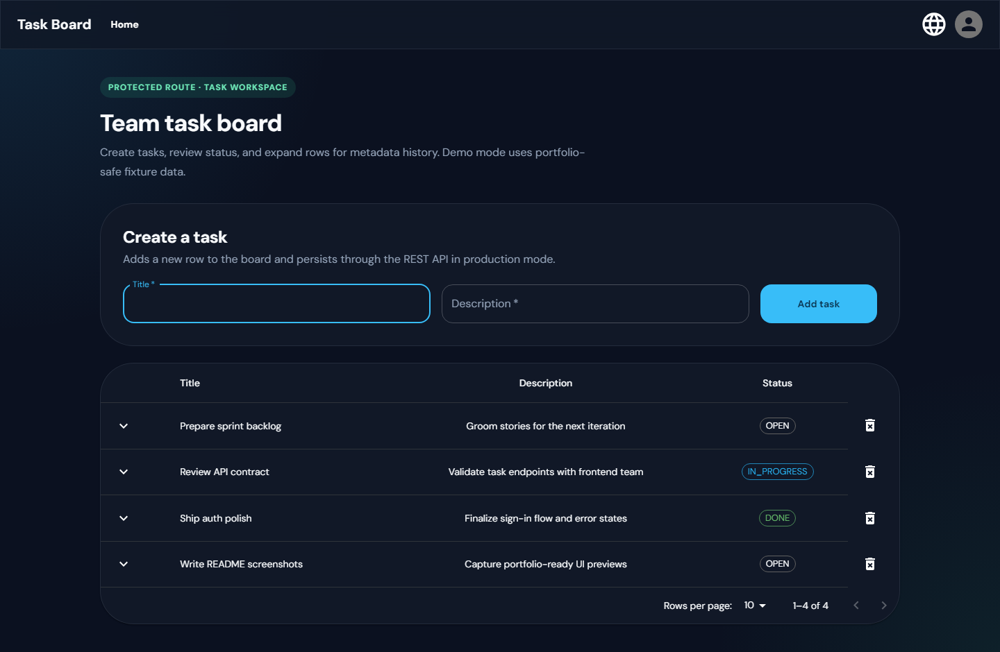

# Task Management — React Client

React task management UI with authentication, CRUD operations, and Redux Toolkit state — built with Create React App and Material UI.

> **Portfolio:** [ibrahimqumseya.github.io](https://ibrahimqumseya.github.io) · Related WebSocket server: [task-management-web-socket](https://github.com/IbrahimQumseya/task-management-web-socket)

## Problem Solved

A **task board frontend** with sign-in/sign-up, task list, create/delete flows, and centralized state — demonstrating React patterns (hooks, Redux Toolkit async thunks, protected routes) used in production SPAs.

## Core Features

| Feature | Description |
| --- | --- |
| **Authentication** | Sign in / sign up with JWT-style session handling |
| **Task CRUD** | Create, list, and delete tasks via REST API |
| **Redux Toolkit** | Slices for user, tasks, metadata, and dialog state |
| **Material UI** | Responsive layout and data table |
| **i18n** | English / Romanian language files |
| **Cypress** | E2E test setup included |

## Stack

| Layer | Technology |
| --- | --- |
| **UI** | React 17, Material UI 4/5 |
| **State** | Redux Toolkit, React Redux |
| **Routing** | React Router 6 |
| **HTTP** | Axios |
| **Testing** | React Testing Library, Cypress |
| **Build** | Create React App |

## Project Structure

```
src/
├── api/              # Axios API modules (tasks, user, metadata)
├── components/       # NavBar, tables, auth helpers
├── features/         # Redux slices (tasks, user, dialog, …)
├── screens/          # Home, SignIn, SignUp, Profile
└── redux/store.js    # Store configuration
```

## Getting Started

### Prerequisites

- Node.js 16+
- npm
- A REST API backend exposing `/auth/*` and `/tasks/*` endpoints (not included in this repo)

### Install & run

```bash
git clone https://github.com/IbrahimQumseya/task-managment-front-end.git
cd task-managment-front-end
npm install
npm start
```

App runs at **http://localhost:3000**.

Configure the API base URL in `src/api/newAPI.js` (or via environment variables if you add them).

### Scripts

| Script | Description |
| --- | --- |
| `npm start` | Development server |
| `npm run build` | Production build |
| `npm test` | Unit tests |
| `npm run test:e2e` | Open Cypress |

## Related Project

**[task-management-web-socket](https://github.com/IbrahimQumseya/task-management-web-socket)** — NestJS + Socket.io real-time gateway with a static Vue demo. Separate project from the same portfolio era; this React app uses REST, not WebSockets.

## Screenshots / Demo

| Screen | Preview |
| --- | --- |
| Sign in |  |
| Task table (home) |  |

## License

This project is licensed under the MIT License — see the [LICENSE](LICENSE) file for details.
